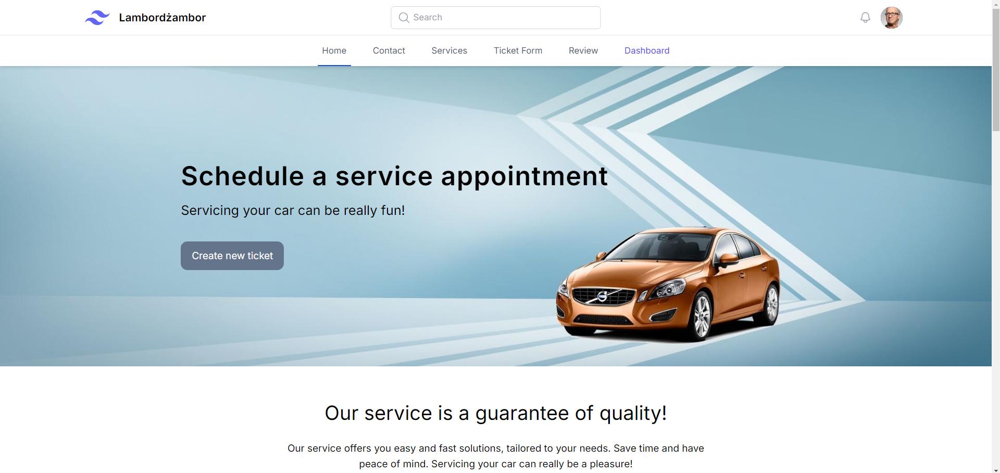
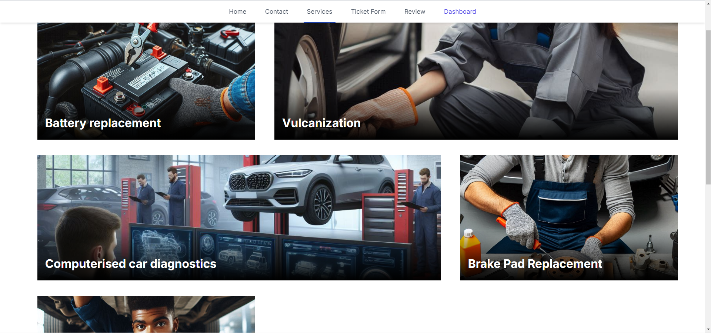
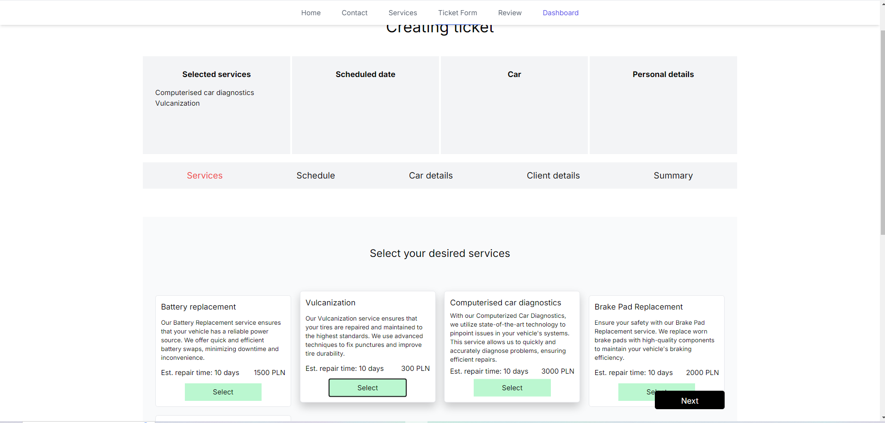
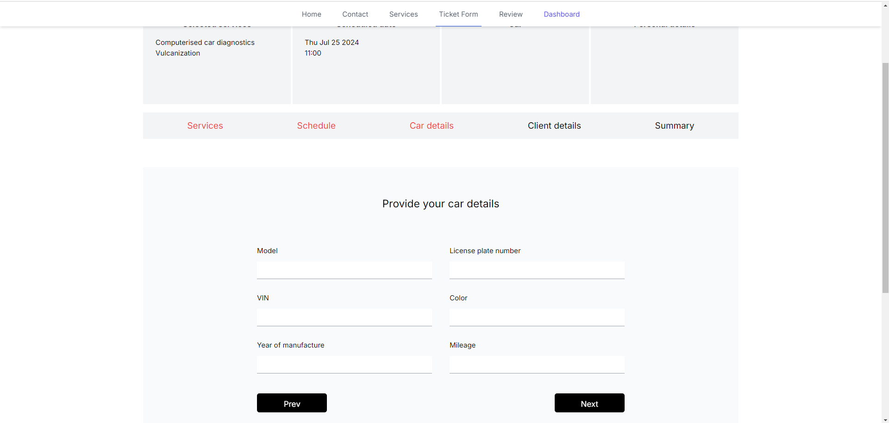
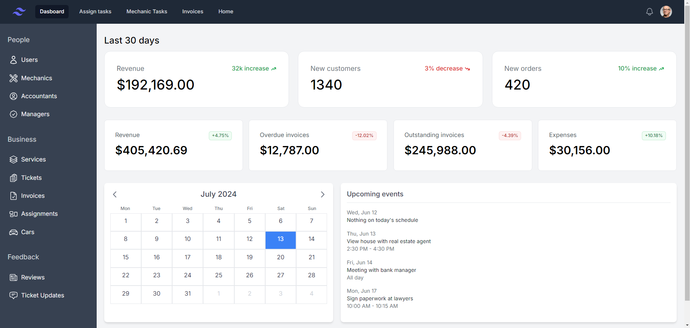
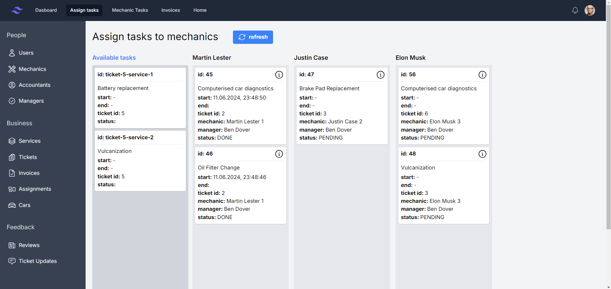
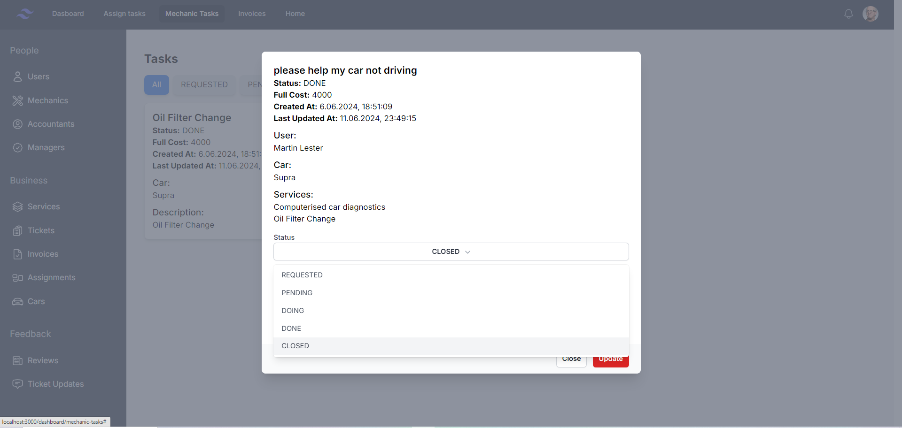
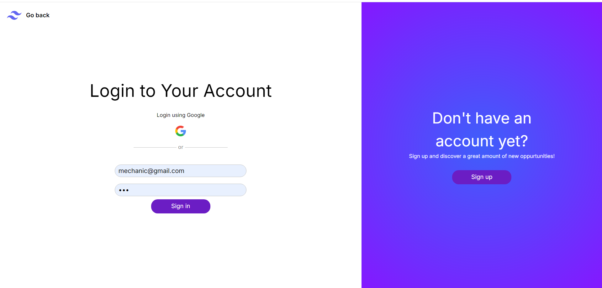
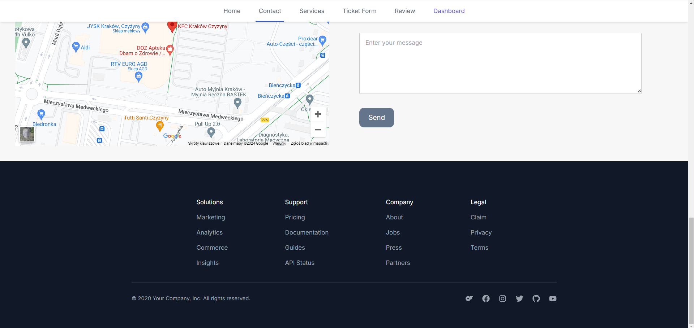

# Authorized Car Service Center

Platform for an authorized car service center that contains a website as well as a 
system that supports an internal management system for scheduling tasks among employees.

This was a university project done in a team of 4 students:  
[@JakubDralus](https://github.com/JakubDralus)
[@Veczar](https://github.com/Veczar)
[@luukis](https://github.com/lukiiis)
[@zysio](https://github.com/zysio)

## Table of contents

1. [Website](#website)
2. [Main Product Features](#main-product-features)
3. [Technologies Used](#technologies-used)

## Website

### Home page

### Services

### Ticket Form

### Dashboard

### Login page

### Contact and footer

## Main Product Features

The system includes the following functionalities:

1. **Customer Registration:** The system allows for the registration of customers, collecting 
their contact information and service history.

2. **Repair Orders:** Ability to create and manage repair orders, including specifying the 
type of repair, deadlines, and assigning mechanics to specific tasks.

3. **Scheduling:** The system allows for creating work schedules for workshop staff, taking into 
account the availability of mechanics and repair deadlines.

4. **Customer Service:** Providing customers with access to information about the status of their 
vehicle repairs and the ability to communicate with the workshop through the system.

5. **Invoicing and Settlements:** Generating invoices for customers based on completed repairs, 
tracking payments, and settlements with mechanics.

6. **Reporting and Analysis:** The system allows for generating reports on workshop performance, 
repair costs, financial turnover, and other key indicators.

## Technologies Used
backend:
- Java 17
- Spring Boot 3.2.4 (starter parent)
- Hibernate 6.4
- Spring Security 6.2
- AWS S3 (with aws sdk 2.20.26)
- PostgreSQL
- Docker

frontend:
- React 18.3.1
- Typescript 4.9.5
- Tailwind 3.4.3
